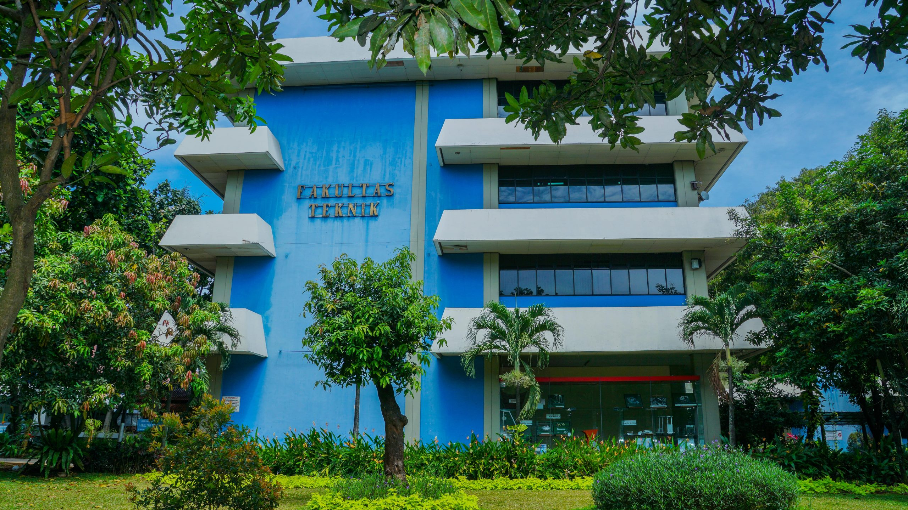
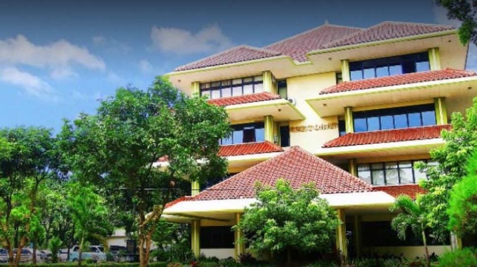

# Profil Fakultas Teknik Universitas Pancasila

## Tugas Individu

Website ini dibuat sebagai tugas individu untuk membuat halaman profil organisasi kampus menggunakan HTML dan CSS.

Tema yang digunakan adalah **Profil Fakultas Teknik Universitas Pancasila**.

Website ini berisi informasi mengenai profil Fakultas Teknik, gambar gedung, program studi, kegiatan mahasiswa, alur pendaftaran, dan informasi kontak.

---

## Ketentuan Tugas

Website dibuat dengan ketentuan:

- Minimal 2 gambar
- Minimal 4 link
- Terdapat anchor internal
- Terdapat external link
- Terdapat mailto link
- Menggunakan 3 jenis list

Semua ketentuan tersebut diterapkan pada website yang dibuat.

### Penerapan Ketentuan

**1. Dua gambar**

Website menggunakan dua gambar pada bagian Profil:

- Gambar Gedung Fakultas Teknik
- Gambar Gedung Universitas Pancasila

**2. Empat link**

Website menggunakan beberapa jenis link, yaitu:

- Link navigasi internal ke bagian Profil
- Link navigasi internal ke bagian Program
- Link navigasi internal ke bagian Pendaftaran
- Link navigasi internal ke bagian Kontak
- Link email menggunakan mailto
- Link website Universitas Pancasila
- Link website Fakultas Teknik
- Link kembali ke bagian atas

**3. Anchor internal**

Anchor internal digunakan pada menu navigasi dan link "Kembali ke atas".

Contoh:

```html
<a href="#profil">Profil</a>
```

dan:

```html
<a href="#beranda">Kembali ke atas</a>
```

**4. External link**

External link digunakan untuk menuju website Universitas Pancasila dan website Fakultas Teknik.

**5. Mailto**

Mailto digunakan pada alamat email:

```html
<a href="mailto:info@univpancasila.ac.id">
    info@univpancasila.ac.id
</a>
```

**6. Tiga jenis list**

Website menggunakan tiga jenis list:

- Unordered List (`<ul>`) untuk program studi
- Ordered List (`<ol>`) untuk kegiatan mahasiswa
- Description List (`<dl>`) untuk alur pendaftaran

---

# Struktur Folder

Struktur folder project:

```text
project/
│
├── tugas1.html
├── README.md
│
├── css/
│   └── style2.css
│
└── images/
    ├── teknik.jpg
    ├── up.jpg
    ├── screenshot1.png
    └── screenshot2.png
```

### Keterangan

- `tugas1.html` : file utama website.
- `README.md` : dokumentasi project.
- `css/style2.css` : file CSS untuk mengatur tampilan website.
- `images/teknik.jpg` : gambar Gedung Fakultas Teknik.
- `images/up.jpg` : gambar Gedung Universitas Pancasila.
- `images/web.png` : screenshot hasil website bagian atas.
- `images/web2.png` : screenshot hasil website bagian bawah.

---

# Tampilan Website

Berikut adalah hasil tampilan website yang telah dibuat.

## Screenshot 1 - Bagian Atas

Screenshot pertama menampilkan judul website, menu navigasi, bagian profil, serta dua gambar gedung.


## Screenshot 2 - Bagian Bawah

Screenshot kedua menampilkan program studi, kegiatan mahasiswa, alur pendaftaran, dan bagian kontak.


---

# Isi Website

## 1. Header dan Navigasi

Bagian header menampilkan judul:

**Fakultas Teknik Universitas Pancasila**

Di bawah judul terdapat menu navigasi:

- Profil
- Program
- Pendaftaran
- Kontak

Kode yang digunakan:

```html
<header id="beranda">
    <h1>Fakultas Teknik Universitas Pancasila</h1>

    <nav>
        <a href="#profil">Profil</a>
        <a href="#program">Program</a>
        <a href="#pendaftaran">Pendaftaran</a>
        <a href="#kontak">Kontak</a>
    </nav>
</header>
```

---

## 2. Profil

Bagian Profil berisi informasi singkat mengenai Fakultas Teknik Universitas Pancasila.

Pada bagian ini terdapat dua gambar:

1. Gedung Fakultas Teknik
2. Gedung Universitas Pancasila

Kode:

```html
<section id="profil">
    <h2>Profil</h2>

    <p>
        Fakultas Teknik Universitas Pancasila merupakan fakultas
        yang bergerak di bidang teknik dan teknologi.
    </p>

    

    
</section>
```

---

## 3. Program Studi

Bagian Program Studi menggunakan **Unordered List (`<ul>`)**.

Daftar program studi:

- Teknik Informatika
- Teknik Sipil
- Teknik Mesin
- Teknik Industri

Kode:

```html
<section id="program">
    <h2>Program Studi</h2>

    <ul>
        <li>Teknik Informatika</li>
        <li>Teknik Sipil</li>
        <li>Teknik Mesin</li>
        <li>Teknik Industri</li>
    </ul>
```

---

## 4. Kegiatan Mahasiswa

Bagian Kegiatan Mahasiswa menggunakan **Ordered List (`<ol>`)**.

Kegiatan yang ditampilkan:

1. Kegiatan akademik
2. Organisasi mahasiswa
3. Seminar dan pelatihan

Kode:

```html
<h3>Kegiatan Mahasiswa</h3>

<ol>
    <li>Kegiatan akademik</li>
    <li>Organisasi mahasiswa</li>
    <li>Seminar dan pelatihan</li>
</ol>
```

---

## 5. Alur Pendaftaran

Bagian Alur Pendaftaran menggunakan **Description List (`<dl>`)**.

Tahapan pendaftaran:

1. Pendaftaran
2. Seleksi
3. Daftar Ulang

Kode:

```html
<section id="pendaftaran">
    <h2>Alur Pendaftaran</h2>

    <dl>
        <dt><b>1. Pendaftaran</b></dt>
        <dd>Mengisi formulir pendaftaran.</dd>

        <dt><b>2. Seleksi</b></dt>
        <dd>Mengikuti proses seleksi.</dd>

        <dt><b>3. Daftar Ulang</b></dt>
        <dd>Melakukan daftar ulang setelah diterima.</dd>
    </dl>
</section>
```

---

## 6. Kontak

Bagian Kontak berisi email dan link website.

### Email

Email menggunakan `mailto`.

```html
<p>
    Email:
    <a href="mailto:info@univpancasila.ac.id">
        info@univpancasila.ac.id
    </a>
</p>
```

### Website Universitas Pancasila

```html
<p>
    <a href="https://www.univpancasila.ac.id/" target="_blank">
        Website Universitas Pancasila
    </a>
</p>
```

### Website Fakultas Teknik

```html
<p>
    <a href="https://ft.univpancasila.ac.id/" target="_blank">
        Website Fakultas Teknik
    </a>
</p>
```

### Kembali ke Atas

```html
<p>
    <a href="#beranda">Kembali ke atas</a>
</p>
```

---

# Kode HTML Lengkap

```html
<!DOCTYPE html>
<html lang="id">
<head>
    <meta charset="UTF-8">
    <meta name="viewport" content="width=device-width, initial-scale=1.0">
    <title>Profil Fakultas Teknik</title>
    <link rel="stylesheet" href="css/style2.css">
</head>

<body>

<header id="beranda">
    <h1>Fakultas Teknik Universitas Pancasila</h1>

    <nav>
        <a href="#profil">Profil</a>
        <a href="#program">Program</a>
        <a href="#pendaftaran">Pendaftaran</a>
        <a href="#kontak">Kontak</a>
    </nav>
</header>

<hr>

<section id="profil">
    <h2>Profil</h2>
    <p>
        Fakultas Teknik Universitas Pancasila merupakan fakultas
        yang bergerak di bidang teknik dan teknologi.
    </p>

    
    
</section>

<hr>

<section id="program">
    <h2>Program Studi</h2>

    <!-- Unordered List -->
    <ul>
        <li>Teknik Informatika</li>
        <li>Teknik Sipil</li>
        <li>Teknik Mesin</li>
        <li>Teknik Industri</li>
    </ul>

    <!-- Ordered List -->
    <h3>Kegiatan Mahasiswa</h3>
    <ol>
        <li>Kegiatan akademik</li>
        <li>Organisasi mahasiswa</li>
        <li>Seminar dan pelatihan</li>
    </ol>
</section>

<hr>

<section id="pendaftaran">
    <h2>Alur Pendaftaran</h2>

    <!-- Description List -->
    <dl>
        <dt><b>1. Pendaftaran</b></dt>
        <dd>Mengisi formulir pendaftaran.</dd>

        <dt><b>2. Seleksi</b></dt>
        <dd>Mengikuti proses seleksi.</dd>

        <dt><b>3. Daftar Ulang</b></dt>
        <dd>Melakukan daftar ulang setelah diterima.</dd>
    </dl>
</section>

<hr>

<section id="kontak">
    <h2>Kontak</h2>

    <!-- Mailto -->
    <p>
        Email:
        <a href="mailto:info@univpancasila.ac.id">
            info@univpancasila.ac.id
        </a>
    </p>

    <!-- External Link -->
    <p>
        <a href="https://www.univpancasila.ac.id/" target="_blank">
            Website Universitas Pancasila
        </a>
    </p>

    <!-- External Link -->
    <p>
        <a href="https://ft.univpancasila.ac.id/" target="_blank">
            Website Fakultas Teknik
        </a>
    </p>

    <!-- Anchor Internal -->
    <p>
        <a href="#beranda">Kembali ke atas</a>
    </p>
</section>

<footer>
    <p>&copy; 2026 Fakultas Teknik Universitas Pancasila</p>
</footer>

</body>
</html>
```

---

# Kode CSS Lengkap

File CSS yang digunakan adalah `css/style2.css`.

```css
body {
    font-family: Arial, sans-serif;
    margin: 30px;
}

h1 {
    color: rgb(238, 143, 175);
}

h2 {
    color: rgb(100, 0, 13);
}

img {
    border-radius: 10px;
    margin: 10px;
}

a {
    text-decoration: none;
}

a:hover {
    text-decoration: underline;
}

section {
    margin-bottom: 20px;
}
```

---

# Penjelasan CSS

## Body

```css
body {
    font-family: Arial, sans-serif;
    margin: 30px;
}
```

Digunakan untuk mengatur font menjadi Arial dan memberikan jarak 30px pada halaman.

## H1

```css
h1 {
    color: rgb(238, 143, 175);
}
```

Digunakan untuk memberikan warna pada judul utama website.

## H2

```css
h2 {
    color: rgb(100, 0, 13);
}
```

Digunakan untuk memberikan warna pada judul setiap bagian website.

## Image

```css
img {
    border-radius: 10px;
    margin: 10px;
}
```

Digunakan untuk membuat sudut gambar menjadi melengkung dan memberikan jarak pada gambar.

## Link

```css
a {
    text-decoration: none;
}
```

Digunakan untuk menghilangkan garis bawah pada link.

```css
a:hover {
    text-decoration: underline;
}
```

Digunakan agar garis bawah muncul ketika kursor diarahkan ke link.

## Section

```css
section {
    margin-bottom: 20px;
}
```

Digunakan untuk memberikan jarak antara satu section dengan section lainnya.

---

# Ringkasan Perubahan, Masalah, dan Solusi

Website ini dibuat sebagai halaman profil Fakultas Teknik Universitas Pancasila menggunakan HTML dan CSS. Struktur halaman dibuat dengan beberapa bagian, yaitu Profil, Program Studi, Kegiatan Mahasiswa, Alur Pendaftaran, dan Kontak. Pada bagian Profil ditambahkan dua gambar gedung untuk memenuhi kebutuhan tugas. Website juga menggunakan beberapa jenis link, yaitu anchor internal untuk navigasi halaman, external link menuju website Universitas Pancasila dan Fakultas Teknik, mailto untuk alamat email, serta link untuk kembali ke bagian atas.

Dalam proses pembuatan website, salah satu hal yang perlu diperhatikan adalah hubungan antara file HTML, CSS, dan gambar. File CSS harus berada pada folder yang sesuai dengan alamat yang ditulis pada HTML. Begitu juga dengan gambar, nama file dan lokasi folder harus sesuai agar gambar dapat ditampilkan pada browser. Solusinya adalah membuat struktur folder yang rapi dan memastikan penulisan nama file sesuai dengan lokasi sebenarnya. Setelah dilakukan pengecekan melalui browser, bagian-bagian website dapat ditampilkan sesuai dengan struktur yang telah dibuat.

---

# Pembagian Peran

Tugas ini merupakan tugas individu sehingga seluruh proses pengerjaan dilakukan sendiri.

| Kegiatan | Pelaksana |
|---|---|
| Menentukan topik website | Saya sendiri |
| Membuat struktur HTML | Saya sendiri |
| Membuat navigasi | Saya sendiri |
| Menambahkan gambar | Saya sendiri |
| Membuat program studi | Saya sendiri |
| Membuat kegiatan mahasiswa | Saya sendiri |
| Membuat alur pendaftaran | Saya sendiri |
| Membuat bagian kontak | Saya sendiri |
| Membuat CSS | Saya sendiri |
| Melakukan pengecekan website | Saya sendiri |
| Mengambil screenshot | Saya sendiri |
| Membuat README | Saya sendiri |

---
# Kesimpulan

Website Profil Fakultas Teknik Universitas Pancasila berhasil dibuat menggunakan HTML dan CSS. Website telah menerapkan berbagai elemen HTML seperti heading, paragraph, image, navigation, internal anchor, external link, mailto, unordered list, ordered list, description list, section, dan footer.

CSS digunakan untuk mengatur tampilan website, seperti jenis font, warna judul, bentuk gambar, link, dan jarak antar bagian. Website juga telah dilengkapi dengan dua gambar dan beberapa jenis link sesuai dengan ketentuan tugas.

Project ini menjadi latihan untuk memahami dasar pembuatan website menggunakan HTML dan CSS serta memahami hubungan antara file HTML, CSS, dan gambar dalam satu project.